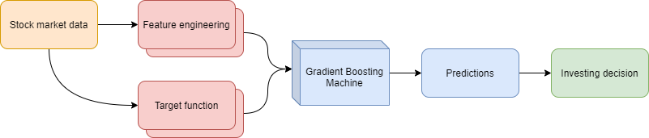

# Investing algorithms
## Stock market

|     |
|:----------------------------------------------------------------:|
|                *Stock market trading pipeline*                   |

### Upper-level description
The goal of this algorithm is to maximize the overall profit from stocks trading. Of course, we can look at the data with different timeframes (5 minutes, 1 hour etc.).  
Having this data we neeed to find the appropriate target function (future close price, indicator whether the price will be more or less than current close price or not 
and many others) and features that will be useful for solving choosed problem. Actually, we don't have a lot of data, so it's the only way to use classic machine learning algorithms like GBM.  
After training our model we can pass the test data through it and get probabilities for classification problem or number for regression one. Next step is to do something with this result. Easiest way is to choose some kind of threshold which will give us a "confidence" of a prediction.
